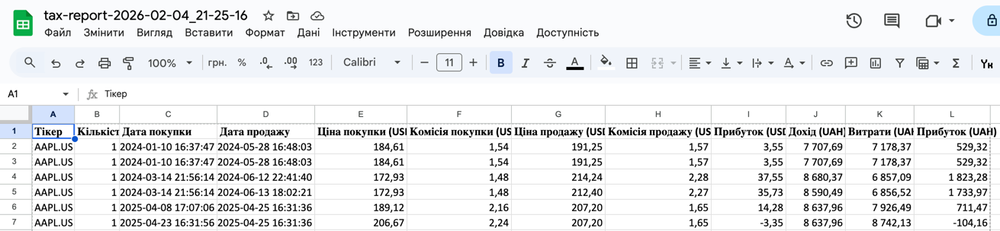
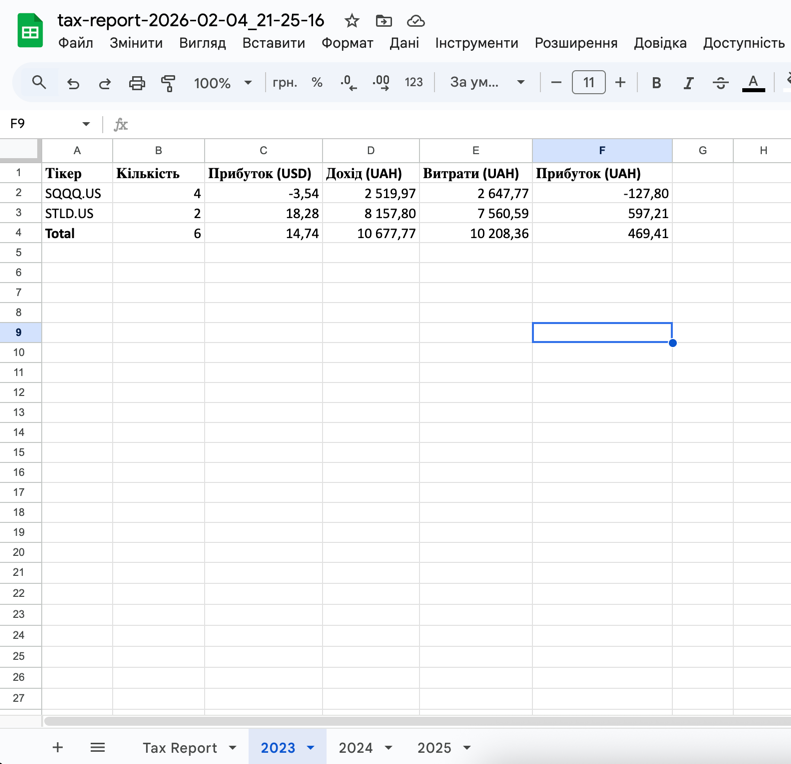

# Freedom FIFO Tax Calculator

[](https://opensource.org/licenses/MIT)

Tax calculator for Freedom Finance using FIFO method. Tracks each share individually for accurate profit calculation in UAH according to Ukrainian tax standards.

Built for personal use to simplify tax reporting. Even in beta, it can save time on repetitive calculations and help you avoid unnecessary manual work, especially if you have many trades to track.

⚠️ **Beta version.** May contain bugs. Please compare results with your previous reports before relying on this tool. Found a bug? [Open an issue](https://github.com/kolesnikovartem075/freedom-fifo-tax-calculator/issues)

## What is FIFO?

**FIFO (First In, First Out)** is an accounting method where shares purchased first are sold first. This is the standard method for tax calculation in Ukraine.
**Example:**
- Jan 15: Buy 10 AAPL shares at \$100
- Mar 10: Buy 5 AAPL shares at \$120
- Jun 20: Sell 12 AAPL shares at \$150

Using FIFO: first sell 10 shares at \$100 cost, then 2 shares at \$120 cost. Each transaction is matched according to the FIFO method.

## How it calculates

**Step 1: Split trades into units**

When you buy/sell multiple shares in a single order, the calculator splits them into individual records. Each share keeps its own price and commission.

**Step 2: Match buy/sell using FIFO**

When you sell shares, the calculator automatically takes shares from the earliest purchases first. It continues in order until the sell quantity is fully matched.

**Step 3: Calculate income/expense/profit per share**

The calculator determines profit for each closed position using the following formulas. All calculations are done **without rounding**.

```
Profit USD = Sell Price - Buy Price - Buy Commission - Sell Commission

Income UAH = Sell Price × Sell Rate
Expense UAH = (Buy Price × Buy Rate) + (Buy Commission × Buy Rate) + (Sell Commission × Sell Rate)
Profit UAH = Income UAH - Expense UAH
```
**Note:**
- **Buy Rate** is the official exchange rate on the purchase date
- **Sell Rate** is the official exchange rate on the sale date
- For the exact implementation and logic, refer to the `PositionCalculator` class in the source code

**Example:**
- Buy: \$100, commission \$0.50, rate 37.5 UAH$ (exchange rate on buy date)
- Sell: \$150, commission \$0.50, rate 41.0 UAH/$ (exchange rate on sell date)
```
Profit USD = 150 - 100 - 0.50 - 0.50 = $49.00

Income UAH = 150 × 41.0 = 6150
Expense UAH = (100 × 37.5) + (0.50 × 37.5) + (0.50 × 41.0) = 3750 + 18.75 + 20.50 = 3789.25
Profit UAH = 6150 - 3789.25 = ₴2360.75
```
## Requirements

- Git (only if cloning the repository)
- Java 21 (Gradle is included via wrapper)

## Input Files

### 1. Broker Report (-Dbroker.report=path/to/broker-report.xlsx)
Excel file exported from Freedom Finance with trade history.

**How to export:**
1. Go to [Freedom24 Reports](https://freedom24.com/cabinet?tabId=reports)
2. Select **Broker report / Звіт брокера** → **Over a period / За період**
3. Set the date range from your first trade to today
4. Download the Excel file

**Important:** export the complete trade history from the beginning — FIFO calculations rely on all previous buy transactions.

### 2. Exchange Rates (-Drates.file=path/to/rates.json)
JSON file with official NBU (National Bank of Ukraine) exchange rates.

**How to get:**
- Download from [NBU Open Data](https://bank.gov.ua/en/markets/exchangerate-chart?cn%5B%5D=USD)
- Must cover all dates when trades occurred

## Installation & Usage
```bash
# Clone repository
git clone https://github.com/kolesnikovartem075/freedom-fifo-tax-calculator.git
cd freedom-fifo-tax-calculator

# Run on Unix/macOS
./gradlew run -Dbroker.report=path/to/broker-report.xlsx -Drates.file=path/to/rates.json

# Run on Windows (PowerShell)
gradlew.bat run -Dbroker.report=path\to\broker-report.xlsx -Drates.file=path\to\rates.json
```

## Output

After running the calculator, it generates an Excel file named `tax-report-YYYY-MM-DD_HH-mm-ss.xlsx` with multiple sheets:

### Detail Sheet
Each closed position with full details (per share):

| Ticker   | Quantity | Buy Date           | Sell Date          | Buy Price (USD) | Buy Commission (USD) | Sell Price (USD) | Sell Commission (USD) | Profit (USD) | Income (UAH) | Expense (UAH) | Profit (UAH) |
|----------|---------|------------------|------------------|----------------|--------------------|----------------|---------------------|--------------|--------------|---------------|--------------|
| AAPL.US  | 1       | 2024-01-10 16:37 | 2024-05-28 16:48 | 184.61         | 1.54               | 191.25         | 1.57                | 3.55         | 7,707.69     | 7,178.37      | 529.32       |
| AAPL.US  | 1       | 2024-03-14 21:56 | 2024-06-12 22:41 | 172.93         | 1.48               | 214.24         | 2.28                | 37.55        | 8,680.37     | 6,857.09      | 1,823.28     |
| MSFT.US  | 1       | 2024-01-20 09:45 | 2024-05-01 15:20 | 210.00         | 1.00               | 220.00         | 1.00                | 8.00         | 6,600.00     | 6,300.00      | 300.00       |
| TSLA.US  | 1       | 2024-03-15 13:10 | 2024-06-10 17:00 | 600.00         | 2.00               | 650.00         | 2.00                | 46.00        | 29,500.00    | 27,660.00     | 1,840.00     |

---

### Year Sheet (Summary by ticker)
| Ticker   | Quantity | Profit (USD) | Income (UAH) | Expense (UAH) | Profit (UAH) |
|----------|---------|--------------|--------------|---------------|--------------|
| AAPL.US  | 2       | 41.10        | 16,388.06    | 14,035.46     | 2,352.60     |
| MSFT.US  | 1       | 8.00         | 6,600.00     | 6,300.00      | 300.00       |
| TSLA.US  | 1       | 46.00        | 29,500.00    | 27,660.00     | 1,840.00     |
| **Total**| 4       | 95.10        | 52,488.06    | 48,995.46     | 3,492.60     |

## Example




## License

MIT